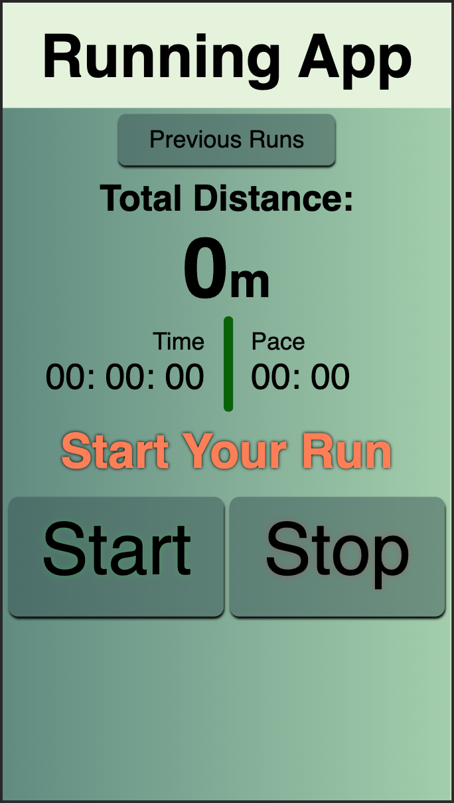
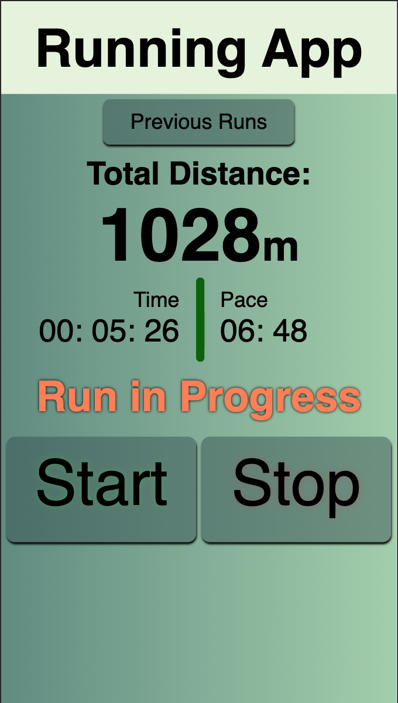
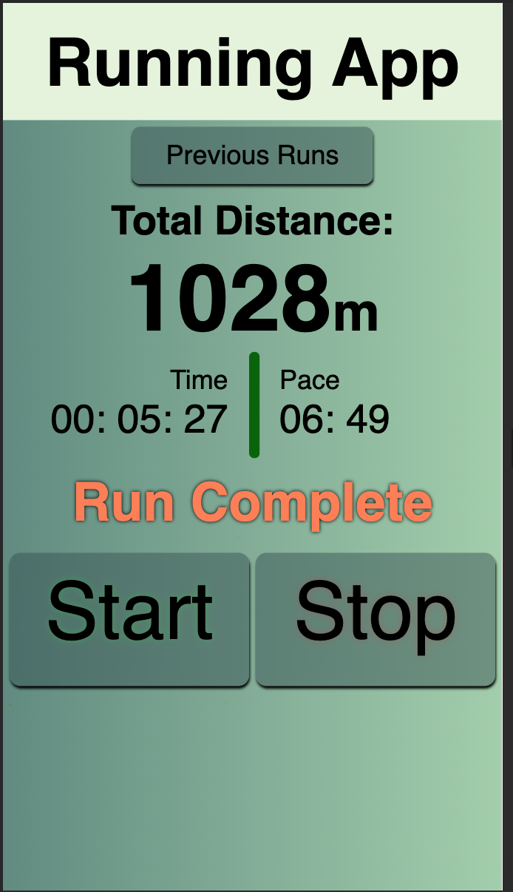
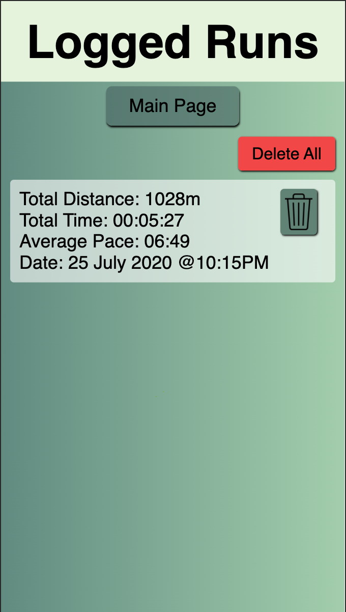

# Running App

### A web application to track running progress.

My first fullstack project. Front-end made with JavaScript, CSS and HTML. Back-end made with node.js and express. Database made with nedb. Deployed to Heroku and glitch

Online app which tracks several measure for a run.
* total distance
* total time
* pace
* date

App contains a database for persistance for usage in several sessions

Before a run:  

During a run: 

Completed a run: 

List of all runs: 

Online app can be accessed at:

https://running-app-tanson.herokuapp.com/

or

https://tansonlee-running-app.glitch.me
